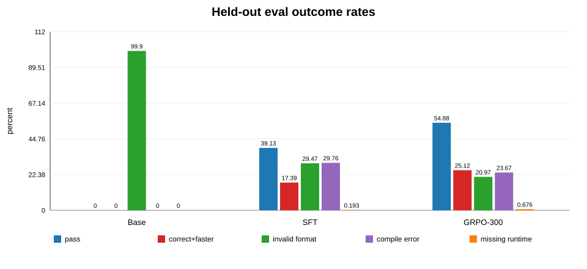
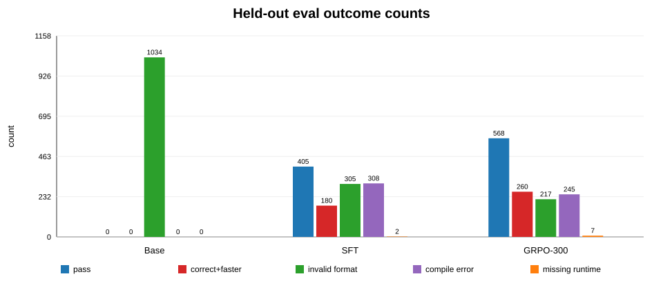
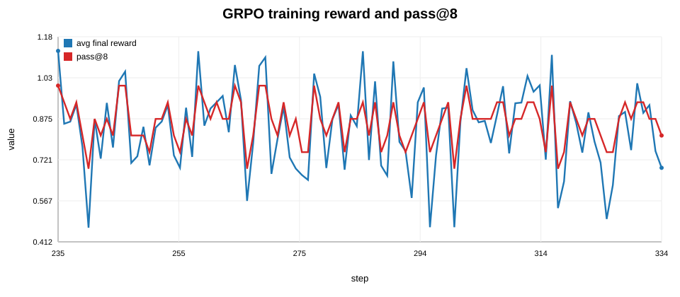
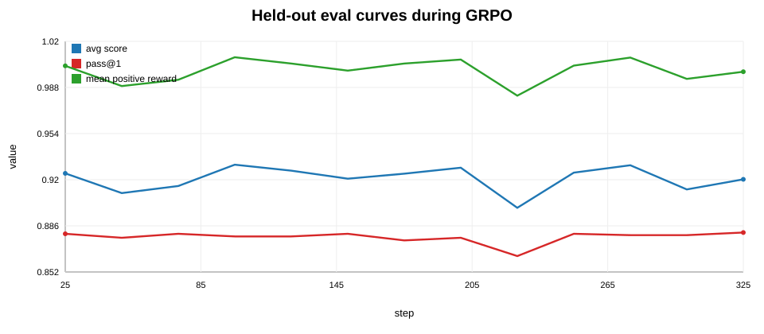
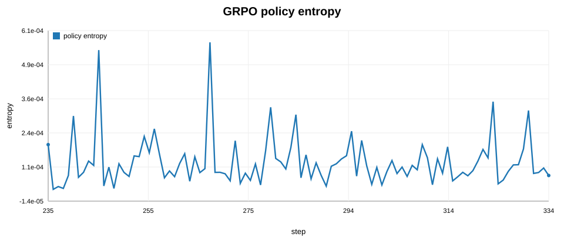
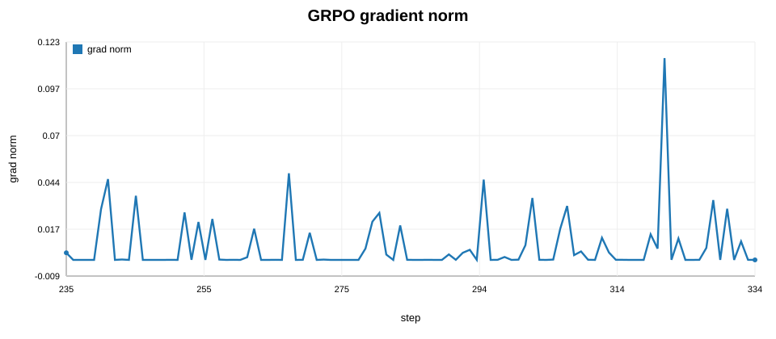
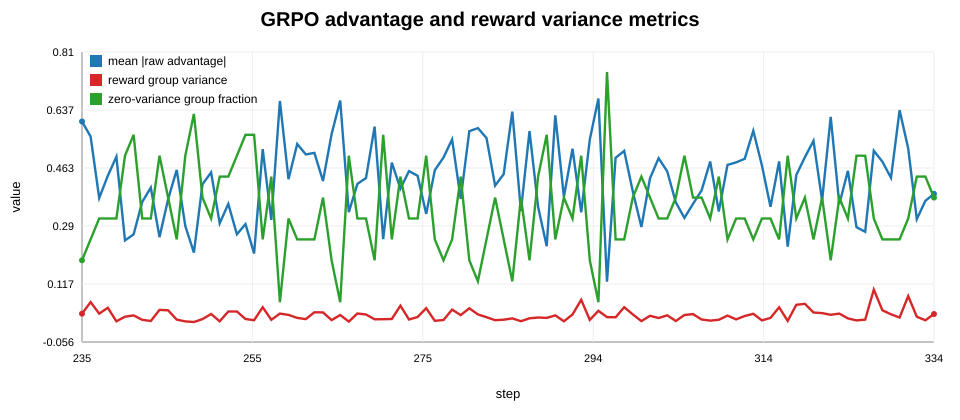
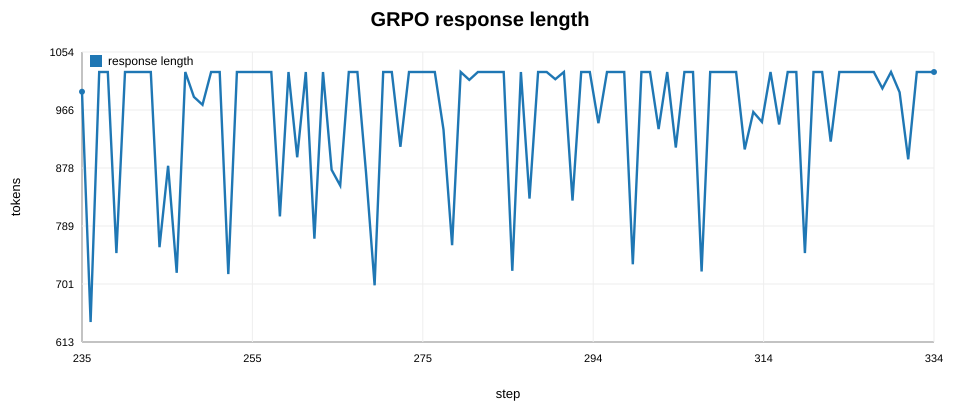
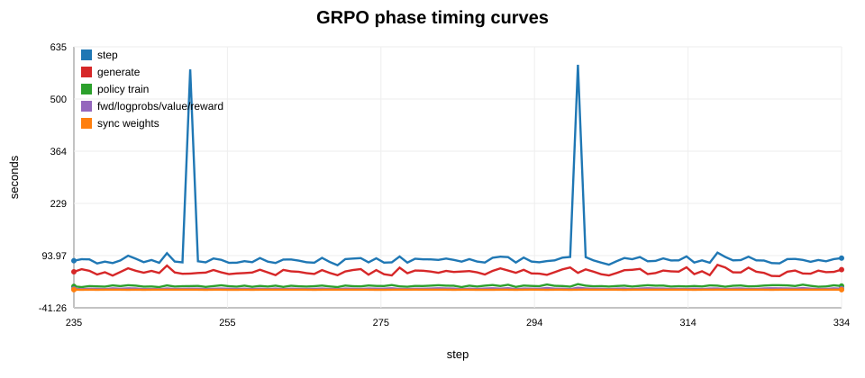

# Raw Run Evidence: `r20260622054433`

This file is data-first. It lists raw artifacts, recomputed aggregate tables, and generated curves without narrative interpretation.

Companion interpretation report: [RUN_REPORT_r20260622054433.md](RUN_REPORT_r20260622054433.md)

## Source Artifacts

Run ID:

```text
r20260622054433
```

Run root:

```text
.w8-biayn/runs/r20260622054433
```

Dataset:

```text
gs://lifeandhalf-24122025-w8-biayn/datasets/cpp-perf/cpp-perf-v1/full-official/r20260614104332/skyrl
```

GRPO checkpoint evaluated:

```text
gs://lifeandhalf-24122025-w8-biayn/runs/cpp-perf/r20260622054433/cpp-grpo/ckpts/global_step_300
```

Raw asset bundle:

```text
RUN_REPORT_RAW_r20260622054433_assets/
```

## Recompute Command

```bash
uv run w8-biayn eval cpp \
  --records base=.w8-biayn/runs/r20260622054433/eval/base.records.jsonl \
  --records sft=.w8-biayn/runs/r20260622054433/eval/sft.records.jsonl \
  --records grpo=.w8-biayn/runs/r20260622054433/eval/grpo.records.jsonl \
  --out RUN_REPORT_RAW_r20260622054433_assets/uplift-summary-recomputed.json
```

## Eval Summary

CSV source: [eval_summary.csv](RUN_REPORT_RAW_r20260622054433_assets/eval_summary.csv)

| Label | Samples | Pass Count | Pass Rate | Correct+Faster Count | Correct+Faster Rate | Missing Runtime | Invalid Format | Compile Error | Sanitizer Error | Timeout | Mean Reward | Winner Speedup Mean |
|---|---:|---:|---:|---:|---:|---:|---:|---:|---:|---:|---:|---:|
| Base | 1,035 | 0 | 0.00% | 0 | 0.00% | 0 / 1,035 (0.00%) | 1,034 / 1,035 (99.90%) | 0 / 1,035 (0.00%) | 0 / 1,035 (0.00%) | 0 / 1,035 (0.00%) | -0.999420 | 0.000000x |
| SFT | 1,035 | 405 | 39.13% | 180 | 17.39% | 2 / 1,035 (0.19%) | 305 / 1,035 (29.47%) | 308 / 1,035 (29.76%) | 0 / 1,035 (0.00%) | 0 / 1,035 (0.00%) | -0.478437 | 2.849410x |
| GRPO-300 | 1,035 | 568 | 54.88% | 260 | 25.12% | 7 / 1,035 (0.68%) | 217 / 1,035 (20.97%) | 245 / 1,035 (23.67%) | 0 / 1,035 (0.00%) | 0 / 1,035 (0.00%) | 0.245863 | 2.848307x |

Task-set equality:

```text
base task IDs == SFT task IDs == GRPO task IDs: true
```

## Eval Curves





## Formal Gate Raw JSON

Source: [uplift-summary-recomputed.json](RUN_REPORT_RAW_r20260622054433_assets/uplift-summary-recomputed.json)

```json
{
  "uplift_gate": {
    "passed": false,
    "verdict": "held_out_lift_but_gate_failed",
    "held_out_lift": true,
    "missing_runtime_clean": false,
    "required_labels": [
      "base",
      "sft",
      "grpo"
    ],
    "missing_required_labels": [],
    "metric_winners": {
      "correct_and_faster_rate": "grpo",
      "mean_best_reward": "grpo"
    },
    "metric_gates": {
      "grpo_beats_base_and_sft_correct_and_faster_rate": true,
      "grpo_beats_base_and_sft_mean_best_reward": true,
      "all_missing_runtime_rate_zero": false
    },
    "label_status": {
      "base": {
        "missing_runtime_count": 0,
        "missing_runtime_rate": 0.0,
        "missing_runtime_task_ids": []
      },
      "grpo": {
        "missing_runtime_count": 7,
        "missing_runtime_rate": 0.00676328502415459,
        "missing_runtime_task_ids": [
          "pie_cpp_test_002495",
          "pie_cpp_test_002587",
          "pie_cpp_validation_001331",
          "pie_cpp_validation_001335",
          "pie_cpp_validation_001367",
          "pie_cpp_validation_001407",
          "pie_cpp_validation_001408"
        ]
      },
      "sft": {
        "missing_runtime_count": 2,
        "missing_runtime_rate": 0.001932367149758454,
        "missing_runtime_task_ids": [
          "pie_cpp_validation_001331",
          "pie_cpp_validation_003055"
        ]
      }
    },
    "reasons": [
      "missing_runtime_nonzero:grpo,sft"
    ]
  }
}
```

## Missing Runtime Rows

CSV source: [missing_runtime_tasks.csv](RUN_REPORT_RAW_r20260622054433_assets/missing_runtime_tasks.csv)

| Label | Task ID | Problem ID | Reason | Runtime CPU ns | Reference CPU ns | Reward | Tests |
|---|---|---|---|---:|---:|---:|---:|
| SFT | `pie_cpp_validation_001331` | `p03073` | `recoverable_format_missing_runtime` |  |  | 0.2 | 2 / 2 |
| SFT | `pie_cpp_validation_003055` | `p03343` | `recoverable_format_missing_runtime` |  |  | 0.2 | 2 / 2 |
| GRPO-300 | `pie_cpp_test_002495` | `p03704` | `missing_runtime` |  |  | 0.5 | 2 / 2 |
| GRPO-300 | `pie_cpp_test_002587` | `p02274` | `missing_runtime` |  |  | 0.5 | 2 / 2 |
| GRPO-300 | `pie_cpp_validation_001331` | `p03073` | `missing_runtime` |  |  | 0.5 | 2 / 2 |
| GRPO-300 | `pie_cpp_validation_001335` | `p03073` | `missing_runtime` |  |  | 0.5 | 2 / 2 |
| GRPO-300 | `pie_cpp_validation_001367` | `p03073` | `missing_runtime` |  |  | 0.5 | 2 / 2 |
| GRPO-300 | `pie_cpp_validation_001407` | `p03073` | `missing_runtime` |  |  | 0.5 | 2 / 2 |
| GRPO-300 | `pie_cpp_validation_001408` | `p03073` | `missing_runtime` |  |  | 0.5 | 2 / 2 |

## MLflow Tracking Snapshot

Source: `.w8-biayn/runs/r20260622054433/metrics.api.json`

| Field | Value |
|---|---:|
| Backend | `mlflow_api` |
| Tracking state | `metrics_available` |
| Latest scalar step | 334 |
| Metric count | 87 |
| Metric row count | 2939 |

Selected latest metrics:

| Metric | Points | Latest Step | Latest Value |
|---|---:|---:|---:|
| `loss/avg_final_rewards` | 100 | 334 | 0.6907885671 |
| `reward/avg_pass_at_8` | 100 | 334 | 0.8125000000 |
| `eval/all/avg_score` | 13 | 325 | 0.9204629208 |
| `eval/all/pass_at_1` | 13 | 325 | 0.8811594203 |
| `eval/all/mean_positive_reward` | 13 | 325 | 0.9998832107 |
| `policy/policy_entropy` | 100 | 334 | 0.0000802282 |
| `policy/grad_norm` | 100 | 334 | 0.0000135718 |
| `loss/avg_raw_advantages_abs` | 100 | 334 | 0.3861041963 |
| `w8/reward_group_variance_mean` | 100 | 334 | 0.0272751074 |
| `w8/zero_variance_group_fraction` | 100 | 334 | 0.3750000000 |
| `policy/policy_kl` | 0 |  |  |
| `policy/response_length` | 100 | 334 | 1024.0000000000 |
| `timing/step` | 100 | 334 | 87.5287158489 |
| `timing/generate` | 100 | 334 | 57.4804325104 |
| `timing/policy_train` | 100 | 334 | 15.2585194111 |
| `timing/fwd_logprobs_values_reward` | 100 | 334 | 8.1203837395 |
| `timing/sync_weights` | 100 | 334 | 5.5363571644 |

## MLflow Curves















## Artifact Hashes

CSV source: [artifact_hashes.csv](RUN_REPORT_RAW_r20260622054433_assets/artifact_hashes.csv)

| Artifact | Size | SHA-256 |
|---|---:|---|
| `.w8-biayn/runs/r20260622054433/eval/base.records.jsonl` | 493,365 | `efde73786800edec5899122b78919f3d12790f2126a7b88826364c3bccec1ab6` |
| `.w8-biayn/runs/r20260622054433/eval/sft.records.jsonl` | 515,562 | `e1dc58ae8780a68a915ef59fb7133101756457633931fb7e3c730f7bf8647424` |
| `.w8-biayn/runs/r20260622054433/eval/grpo.records.jsonl` | 506,886 | `a9119f0b74d0b295ccf3fcc433ca302e771f2435f09bc9e4f08cea00bd404d5e` |
| `.w8-biayn/runs/r20260622054433/eval/base.summary.json` | 439 | `5292253544f50f613cfbc7ae161e2d7310b928b89bc9dc94f275345befaac7e1` |
| `.w8-biayn/runs/r20260622054433/eval/sft.summary.json` | 515 | `817314647a6114ad3a6f09c44c757aa111f63aa6f3893882583e8f6adb9fee90` |
| `.w8-biayn/runs/r20260622054433/eval/grpo.summary.json` | 516 | `4e01d86b36f136f1a73eba1bd20bc27cdea60659f7cb1103b41e5095308b6502` |
| `.w8-biayn/runs/r20260622054433/status.json` | 785,515 | `436b096c9aed8d48a4b1b6a6984371faec0c3cd419b9a158973b487510da46ea` |
| `.w8-biayn/runs/r20260622054433/metrics.api.json` | 382,714 | `19fb9e1be609cb523d562f724c64e46945b318836b3a4aaf62037ebe63715276` |
| `.w8-biayn/runs/r20260622054433/uplift-summary.json` | 1,757 | `a7b9f6968e762babd6691ccf89e90e4463c5188a9a93f0195d10cf2cfff5f482` |
| `RUN_REPORT_RAW_r20260622054433_assets/uplift-summary-recomputed.json` | 3,757 | `0e828d40e7675525bc640e809783d42e9b68d6cdeeb3ddf5c8da5c976bd358d0` |

## Raw Bundle Index

```text
RUN_REPORT_RAW_r20260622054433_assets/advantage_variance.svg
RUN_REPORT_RAW_r20260622054433_assets/artifact_hashes.csv
RUN_REPORT_RAW_r20260622054433_assets/eval_outcome_counts.svg
RUN_REPORT_RAW_r20260622054433_assets/eval_outcome_rates.svg
RUN_REPORT_RAW_r20260622054433_assets/eval_summary.csv
RUN_REPORT_RAW_r20260622054433_assets/heldout_eval_curves.svg
RUN_REPORT_RAW_r20260622054433_assets/missing_runtime_tasks.csv
RUN_REPORT_RAW_r20260622054433_assets/mlflow_latest_selected.csv
RUN_REPORT_RAW_r20260622054433_assets/mlflow_selected_series.csv
RUN_REPORT_RAW_r20260622054433_assets/policy_entropy.svg
RUN_REPORT_RAW_r20260622054433_assets/policy_grad_norm.svg
RUN_REPORT_RAW_r20260622054433_assets/raw_report_metadata.json
RUN_REPORT_RAW_r20260622054433_assets/response_length.svg
RUN_REPORT_RAW_r20260622054433_assets/timing_breakdown.svg
RUN_REPORT_RAW_r20260622054433_assets/train_reward_pass.svg
RUN_REPORT_RAW_r20260622054433_assets/uplift-summary-recomputed.json
```
